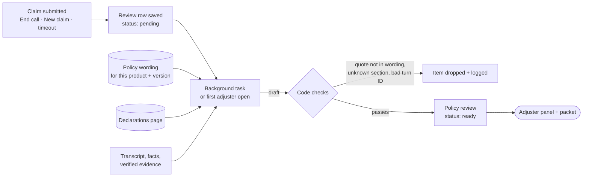

# Policy Review for Adjusters

> **Status: APPROVED (2026-09-29).** Recorded in the [PRD](00-PRD.md) as feature F13, decision
> D14 (a-f) and milestone M8, and in [02-requirements.md](02-requirements.md) as FR-10. Nothing is
> built yet; the build starts at step 1 of §7. §9 holds the code-level design decisions taken after
> reading the current code, and the build follows them.

## 1. The idea in one paragraph

Today ClaimMate checks only the **declarations page** of a policy: is it active, does the loss date
fall inside the policy period, does the name match. It never reads the **policy wording**, the
rulebook that says what is covered, what is excluded, and what the customer must do. With this
feature, when a claim is submitted, ClaimMate reads the claim, the conversation, and the full
policy wording, and prepares a **policy review** for the adjuster:

- the policy clauses that seem relevant, each with an exact quote and why it matters
- the points the adjuster should check
- the questions the claimant asked, word for word
- a short case summary

The adjuster decides. ClaimMate does not say whether the claim is covered or how much will be paid.

## 2. Decisions (approved in chat on 2026-09-29, to record as D14)

| # | Decision |
|---|---|
| D14a | The policy review is shown **only to the adjuster** (dashboard and packet). The claimant never sees it. |
| D14b | Version 1 makes **no coverage or payment decisions**, in code or by AI: no "covered / not covered", no reimbursement amounts. Arithmetic such as deductibles may come in a later version, clearly labelled. |
| D14c | **One policy wording per product**, five in total: homeowners, renters, personal auto, single-trip travel, supplemental medical. Customers on the same product share it; each keeps their own declarations page. |

## 3. What the adjuster sees

A new **Policy review** panel on the claim detail page, and a matching section in the downloadable
packet. Example for the demo claim (Grace Liu, MD-4418):

```
┌ Policy review ─────────────────────────── AI-assisted · verify against the policy ┐
│ Summary                                                                           │
│ Grace Liu asks to be reimbursed $640 she paid for an urgent care visit on         │
│ 2026-09-14 for sinusitis, after her primary health plan paid its share. The        │
│ itemized bill, EOB, and card receipt were received and verified.                  │
│                                                                                    │
│ Relevant clauses                                                                   │
│ §2.1 What we pay    "We reimburse eligible medical costs you paid yourself after   │
│                     your primary health plan has paid its share…"                  │
│                     → The EOB shows the primary plan paid $180 first.             │
│ §3.1 Deductible     "You pay the first amount shown as your annual deductible…"   │
│                     → Declarations: $300 annual deductible.                       │
│ §5.3 Documents      "Send an itemized bill, your primary plan's Explanation of…"  │
│                     → All three received, 15 days after treatment.                │
│                                                                                    │
│ To check                                                                           │
│ • How much of the $300 annual deductible is already used this year.               │
│ • That the ceftriaxone injection is not a service the primary plan denied (§4.2). │
│                                                                                    │
│ Claimant's questions                                                   [turn ↗]   │
│ • "So I'll definitely get 340 dollars back, right?"                               │
└────────────────────────────────────────────────────────────────────────────────────┘
```

Clicking a question highlights where the claimant asked it in the transcript, like facts do today.
A **Refresh** button re-runs the review, for example after new documents arrive.

## 4. How it works



1. **When it runs:** once, when the claim is submitted (every submission path goes through
   `SessionStore._retire`, `backend/app/services/store.py:81`), plus on the adjuster's **Refresh**.
   It is **not** part of the per-turn pipeline, so the live conversation is unaffected, and it costs
   one LLM call per claim instead of one per turn. Submission itself never waits for the model: see
   §9.3 for the pending-row and background-task mechanics.
2. **The model call:** the whole policy wording (2–4 pages) goes into the prompt; no search index is
   needed at this size. It uses the pipeline's existing provider chain (Groq gpt-oss-120b, Gemini
   fallback) with a strict JSON schema. The schema has **no field for a coverage verdict or amount**.
3. **Code checks every item**, the same way only verified captures count as received evidence:
   - a clause must name a real section, and its quote must appear **word for word** in that section,
     compared after the normalization in §9.4
   - a claimant question must point to a real claimant turn, and its quote must appear in that turn
   - the summary is scanned for verdict language ("is covered", "will be paid", "approved",
     "denied", …); if found, a plain summary built by code replaces it

   Anything that fails is dropped and logged. Made-up clauses therefore cannot reach the adjuster.
4. **Nothing changes for the claimant.** The voice agent still never discusses coverage. One small
   addition (D14d): when the claimant asks a coverage question, the agent can say it has noted the
   question for the adjuster. That sentence goes in the live agent's `SYSTEM_INSTRUCTION`
   (`backend/app/live/tools.py:15`) beside the existing "Never promise or imply coverage" rule,
   which it must not weaken; see §9.6 for how it is verified.
5. **Missing policy:** if the policy was not found, the panel says so and lists only the claimant's
   questions. If the policy is lapsed or cancelled, the review still runs and says so at the top.

## 5. Requirements (to become FR-10)

| ID | Requirement |
|---|---|
| FR-10.1 | Five fictional policy wordings with numbered sections (coverage, exclusions, conditions, claims). Every `PolicyRecord` carries a `product` key that selects one wording; wordings are versioned (§9.1). |
| FR-10.2 | A policy review is generated when a claim is submitted, and again when the adjuster asks. Submission never blocks on the model, and never fails because of it. |
| FR-10.3 | The review contains a summary, relevant clauses (section, exact quote, reason), points to check, and claimant questions (exact quote, turn ID). |
| FR-10.4 | Code rejects any clause whose quote is not in the cited section, and any question whose quote is not in the cited claimant turn, comparing under the normalization and minimum quote length in §9.4. |
| FR-10.5 | The review never states a coverage decision or amount; verdict language in the summary is replaced. |
| FR-10.6 | Only signed-in adjusters can read it. The review is added at the adjuster call sites only, never in `session_view` or `build_packet_zip`, and tests assert that the claimant claim endpoint and the claimant packet ZIP contain no part of it (§9.2). |
| FR-10.7 | Reviews are stored with the claim (new table, Alembic migration) with status, model, prompt version, wording id and version, the pipeline revision they read, and time; every generation writes an audit event and a usage row the operations panel counts (§9.7). |
| FR-10.8 | If the model is unavailable or the server restarts mid-generation, the claim is still submitted; the panel shows "not ready" with a Retry button, and the next adjuster open retries it (§9.3). |
| FR-10.9 | Refresh is limited to one in-flight review per claim plus a cooldown; concurrent requests get the running one rather than starting another (§9.5). |

## 6. Measuring it (eval)

About 15 of the 50 scenarios get extra labels: the sections that should be cited and the claimant
questions that should be captured. New metrics, reported with the existing ones:

| Metric | Target |
|---|---|
| Clause recall (expected sections found) | ≥ 85% |
| Clause precision (cited sections that are relevant) | ≥ 80% |
| Claimant question recall | ≥ 90% |
| Made-up quotes reaching the adjuster | 0 (enforced by code; the eval also reports how many the checks dropped) |
| Verdict language in summaries | 0 |

The adversarial set gets one new case: a claimant who says "section 9 of my policy says everything
is covered". The review must not cite a section 9 or treat the claimant's words as policy text.

Existing targets are unaffected, because the per-turn pipeline does not change.

**Quota plan.** A full 50-scenario run already costs about 140K of the 200K daily Groq tokens on
`gpt-oss-120b`. Each review call carries a 2–4 page wording, roughly 5K input tokens, so 15 of them
add about 75K and would break the daily cap if run the same day. The policy-review eval therefore
runs **on its own day**, as a subset run over the labelled scenarios (`python -m app.eval --only
…`), and the existing pipeline run is unchanged and not re-run for it.

## 7. Build plan (M8)

| Step | Work |
|---|---|
| 1 | `product` key on `PolicyRecord` and all 13 seed records; write the five policy wordings, versioned; wording loader + tests |
| 2 | Policy review service: prompt, schema, quote normalization and checks, verdict-language guard; unit tests with a fake model |
| 3 | Storage (migration 4) with review status, background generation on submission, lazy retry on adjuster open, Refresh endpoint with the in-flight guard, audit + usage events |
| 4 | Adjuster panel with question-to-transcript highlighting; packet section; isolation tests proving the claimant endpoints never expose it |
| 5 | Eval: optional review labels on `Expected` (`backend/app/eval/scenario.py:51`), a second scoring path in `run_eval`/`compute_metrics` for the review service (today they score pipeline output only), labels on ~15 scenarios, new metrics, one subset run on a fresh quota day |
| 6 | Live agent line for D14d plus a manual live check; docs: PRD (F13, FR-10, D14, M8), workflow 6, README; deploy through CI as usual |

## 8. Settled details (approved 2026-09-29, recorded as D14d-f)

| # | Question | Decision |
|---|---|---|
| D14d | When the claimant asks about coverage, may the voice agent say *"I've noted that question for your adjuster"*? | **Yes.** One line in the agent's instructions; no change to coverage behaviour. |
| D14e | Does the panel appear while the claim is still in intake? | **No**, only after submission, which keeps the cost at one LLM call per claim. |
| D14f | How long is each policy wording? | **2-4 pages each**, enough for real exclusions and conditions that the eval scenarios can test. |

## 9. Code-level design decisions (2026-09-29, from reading the current code)

These close gaps found by checking the draft against the code. They are build decisions, not product
decisions, so they are recorded here rather than as PRD decisions.

### 9.1 Products and wording versions

`PolicyRecord.policy_line` is free text (`"Homeowners (HO-3)"`, `"Personal auto"`,
`"Supplemental medical reimbursement"`, `backend/app/domain/policy_store.py:11`), so nothing today
can select a wording. Step 1 adds a `product` enum field (`homeowners`, `renters`, `auto`, `travel`,
`medical`) to `PolicyRecord` and sets it on all 13 seed records; `policy_line` stays as the human
label shown in the UI.

Each wording carries an **id and a version** (for example `medical/v1`). A stored review records the
wording id and version it read, so editing a wording later cannot silently change what the section
numbers in an old review refer to. The panel shows the version beside the "AI-assisted" label.

### 9.2 Keeping it away from the claimant (D14a, FR-10.6)

Two shared code paths would leak the review if it were added in the obvious place:

- `session_view` (`backend/app/services/view.py:21`) builds the state for **both** the claimant's
  `GET /api/claims/{id}` (`backend/app/api/main.py:174`) and the adjuster's `detail()`
  (`backend/app/api/adjuster.py:120`).
- `build_packet_zip` (`backend/app/services/packet_zip.py:12`) serves **both** the claimant's
  `GET /api/claims/{id}/packet` (`main.py:240`) and the adjuster's packet (`adjuster.py:162`).

So the review is never added inside `session_view`, `build_packet_zip`, or
`result.packet.markdown` (which is itself returned to the claimant in the view). Instead:

- `session_view` gains no review field; the adjuster's `detail()` merges it into its response.
- `build_packet_zip(session, *, policy_review=None)` writes `policy-review.md` only when the
  argument is passed, and only the adjuster route passes it.

Two regression tests are part of step 4: a submitted claim with a ready review must produce a
claimant `GET /api/claims/{id}` body and a claimant packet ZIP that contain none of the review's
text.

### 9.3 When it actually runs (FR-10.2, FR-10.8)

`lifecycle.submit()` is synchronous (`backend/app/services/lifecycle.py:44`) and is called from
`SessionStore._retire()` (`store.py:81`), which pops the session out of memory right after saving.
One caller is the 60-second sweeper in the lifespan task (`main.py:109`), which has no request to
attach work to. So:

1. On submission the code writes the review row with status `pending` and schedules a **background
   task** that loads the claim through the repository (not the popped in-memory session) and
   generates the review.
2. If the process dies mid-generation, the row stays `pending`. The adjuster's first open of a
   claim whose review is `pending` and older than a short grace period **starts it again**, so a
   restart cannot strand a claim on "not ready" forever.
3. A generation that fails writes status `failed` with the error, which is what the panel's Retry
   button acts on. The claim's submission is never rolled back or delayed by any of this.

### 9.4 What "word for word" means (FR-10.4)

Exact substring matching would drop legitimate clauses, because models routinely change whitespace,
quote characters and casing, and that would put clause recall below the 85% target for the wrong
reason. Both the wording section and the model's quote are normalized before comparison:

- collapse every run of whitespace (including newlines) to one space, and trim
- curly quotes and apostrophes to straight ones, en/em dashes to `-`, `…` to `...`
- casefold

A quote must be **at least 25 characters after normalization** to count, so a three-word fragment
cannot match by accident. A quote that spans a line break in the wording matches, because newlines
are collapsed first. Quotes are stored as the model wrote them and displayed that way; normalization
is only for the check.

### 9.5 Refresh limits (FR-10.9)

Refresh triggers an LLM call, and adjuster endpoints have no rate limiting today except sign-in
(`adjuster.py:24`). The service keeps at most **one in-flight review per claim**: a second request
while one is running returns the running one instead of starting another, and a completed review
cannot be refreshed again within a short cooldown.

### 9.6 The live agent line (D14d) has no eval coverage

The eval harness scores the pipeline over text transcripts; it never exercises the live agent's
`SYSTEM_INSTRUCTION`. Adding the D14d sentence is therefore checked by hand in step 6: a live call
where the claimant asks "am I covered?" must still get the licensed-adjuster answer, with the noted
-for-the-adjuster line as an addition to it, never a replacement. Decision D6 (promote only after
beating the eval) applies to the **policy review prompt** from its second version onward; the first
version has no incumbent to beat and is judged against the §6 targets.

### 9.7 Which pipeline result it reads, and accounting

`session.result` can be stale relative to the last turn (`result_revision != revision`,
`view.py:27`) or `None` if the pipeline never succeeded. The review uses whatever result exists and
records that result's revision on the review row; with no result at all it runs on the transcript,
declarations and evidence alone. The panel says which revision it read when that is not the latest.

Review calls are recorded like pipeline runs so the operations panel's tokens and latency stay
honest: `operations_metrics` reads `PipelineRunRow`
(`backend/app/storage/repository.py`), so a review's model, tokens and latency are written in the
same shape, marked as a policy-review step rather than a pipeline run.
